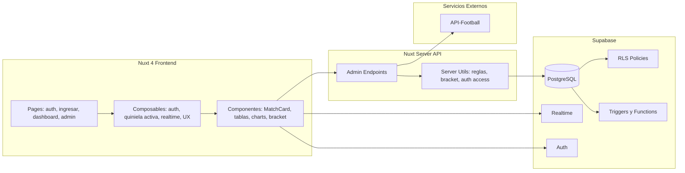
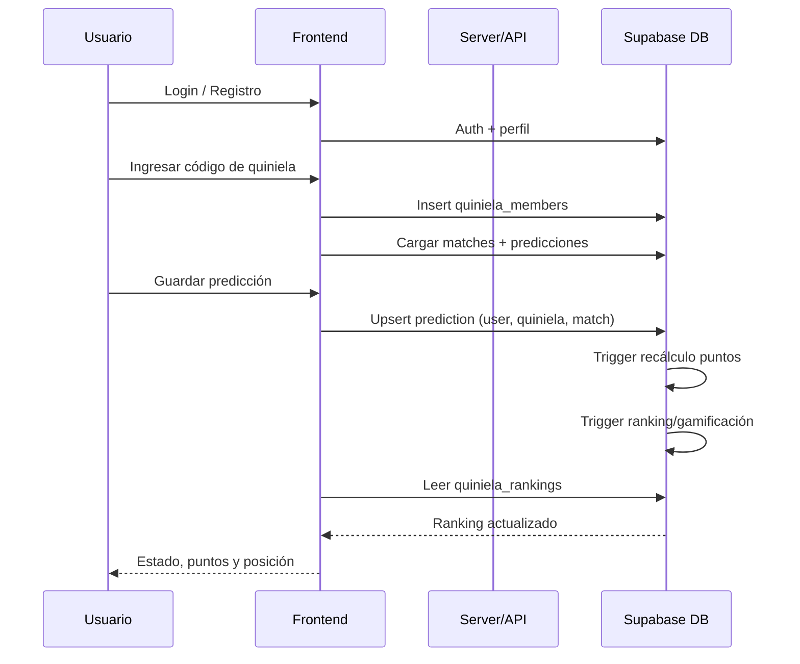
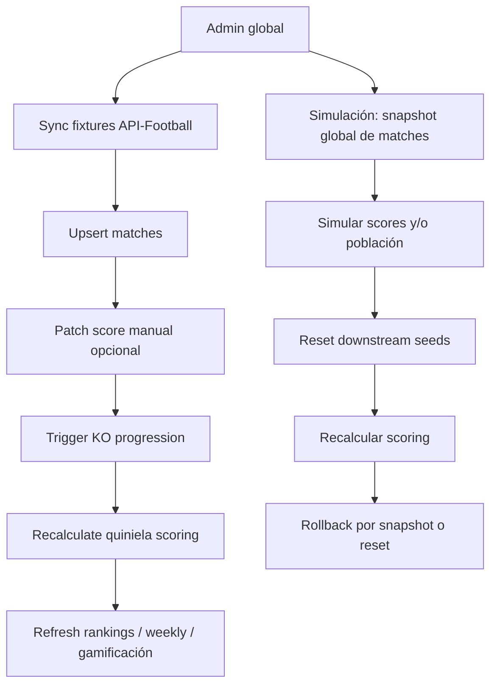
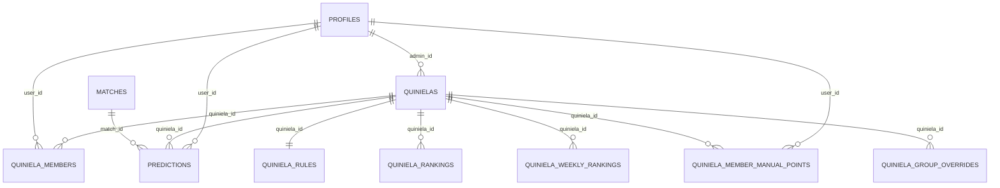

# OVERVIEW: Quiniela Mundial 2026

Documento de análisis integral del repositorio desde tres perspectivas:

- Arquitectura de software
- Desarrollo de software
- Gestión de producto

Fecha de análisis: 2026-04-08

---

## Tabla de Contenidos

1. [Resumen Ejecutivo](#resumen-ejecutivo)
2. [Mapa del Sistema](#mapa-del-sistema)
3. [Perspectiva 1: Arquitecto de Software](#perspectiva-1-arquitecto-de-software)
4. [Perspectiva 2: Desarrollador de Software](#perspectiva-2-desarrollador-de-software)
5. [Perspectiva 3: Gerente de Producto](#perspectiva-3-gerente-de-producto)
6. [Riesgos y Prioridades de Mejora](#riesgos-y-prioridades-de-mejora)
7. [Preguntas Guía para Evolución](#preguntas-guía-para-evolución)
8. [Diagramas Mermaid](#diagramas-mermaid)

---

## Resumen Ejecutivo

El proyecto implementa una plataforma sólida de quinielas para Mundial 2026 con:

- Frontend moderno en Nuxt 4 + Vue 3 + Tailwind/DaisyUI
- Backend en rutas server de Nuxt (H3)
- Supabase como núcleo de datos/autenticación/autorización/realtime
- Lógica de negocio fuerte en SQL (funciones, triggers, RLS)
- Integración con API-Football para ingesta de fixtures y metadatos de equipos

### Lo mejor del sistema hoy

- Modelo de seguridad robusto apoyado en RLS, no solo en frontend.
- Scoring, ranking y progresión knockout automatizados en base de datos.
- Diseño multi-quiniela con aislamiento por `quiniela_id` en predicciones.
- Operación admin avanzada (sync, simulación, ajustes manuales, overrides de grupos).

### Lo más crítico a reforzar

- Cobertura de pruebas aún baja para la complejidad de negocio.
- Alta dependencia de triggers/funciones SQL: poderosa, pero difícil de depurar sin observabilidad adicional.
- `matches` es global para todas las quinielas: simplifica dominio deportivo, pero crea riesgos cuando se usa simulación de scores.

---

## Mapa del Sistema

### Stack y módulos

- App SSR: Nuxt 4
- UI: Tailwind 4 + DaisyUI 5 + componentes Vue
- Charts: Chart.js + vue-chartjs (`*.client.vue`)
- Bracket UI: brackets-viewer
- Auth/Data/Realtime: Supabase
- Testing: Vitest (unit) + smoke SQL en CI

### Estructura funcional

- `pages/`: rutas de producto (`auth`, `ingresar`, `dashboard/*`, `admin/*`)
- `components/`: UI reutilizable de dashboard/admin
- `composables/`: estado sesión/quiniela/realtime/UX events
- `server/api/admin/`: APIs de administración
- `server/utils/`: lógica de dominio servidor (reglas, bracket, segmentos, auth)
- `supabase/migrations/`: evolución del dominio y seguridad SQL
- `tests/`: pruebas unitarias y smoke SQL de migraciones críticas

---

## Perspectiva 1: Arquitecto de Software

### 1) Diseño arquitectónico

El sistema adopta una arquitectura orientada a dominio deportivo con separación práctica:

- Capa de experiencia: páginas/composables/componentes Nuxt
- Capa de aplicación: endpoints `server/api/admin/*`
- Capa de dominio persistente: PostgreSQL + funciones/triggers + RLS
- Capa de integración externa: API-Football

Punto clave: la lógica crítica de negocio (scoring, rankings, bonus, progresión KO) está concentrada en SQL. Esto ofrece consistencia transaccional fuerte y reduce discrepancias entre clientes.

### 2) Seguridad y control de acceso

Fortaleza clara:

- RLS habilitado en tablas sensibles (`profiles`, `quinielas`, `quiniela_members`, `predictions`, etc.).
- Funciones `is_member_of_quiniela`, `is_admin_of_quiniela`, `is_global_admin` usadas tanto en políticas como en rutas.
- API admin con fallback de autenticación por cookie de sesión o bearer token (`server/utils/adminAccess.ts`).

Resultado: incluso si un cliente intenta saltar controles UI, la base de datos sigue imponiendo restricciones.

### 3) Escalabilidad

#### Lo que escala bien

- Precálculo de ranking en `quiniela_rankings` (evita recomputar todo en cada consulta de posiciones).
- Ranking semanal materializado (`quiniela_weekly_rankings`).
- Índices relevantes por quiniela/usuario/match en tablas de alto tráfico.

#### Cuellos potenciales

- Cadena de triggers por actualización de resultados: `matches -> predictions -> quiniela_members -> rankings/gamificación`.
- Carga de consultas concurrentes de UI en layout/header y dashboards.
- Simulación masiva en entorno de datos globales (`matches` no está particionada por quiniela).

### 4) Evolución del modelo de torneo (knockout)

El bracket está bien formalizado en tokens/seeds (`Wxx`, `Lxx`, `3rd(...)`, `bracket_match_no`), con mejoras recientes en migraciones `0028` y `0029`:

- Soporte de penales en KO
- Progresión por tokens persistentes (menos dependencia de orden temporal)
- Overrides de grupos por quiniela para resolver escenarios no triviales

Es una base sólida para escenarios FIFA complejos.

### 5) Riesgos de arquitectura

- Acoplamiento alto entre lógica TS y SQL del bracket (si cambia un lado y no el otro, pueden aparecer inconsistencias).
- Gran parte de la lógica de negocio está en DB; requiere disciplina de versionado y pruebas de migración.
- Simulaciones de score impactan entidad global de partidos (mitigado por snapshots, pero con riesgo operativo si se usa mal).

---

## Perspectiva 2: Desarrollador de Software

### 1) Organización y mantenibilidad del código

Aspectos positivos:

- Convenciones claras por dominio (`admin`, `dashboard`, `utils`).
- Composables bien definidos para sesión/quiniela/realtime.
- Tipado TS consistente en frontend y backend.
- Fallbacks de compatibilidad para migraciones opcionales (`42P01`, `42703`, etc.) bien trabajados.

Aspectos a mejorar:

- Algunas páginas concentran mucha lógica (especialmente `dashboard/mi-quiniela.vue` y `dashboard/estadisticas.vue`).
- El panel `AdminWorkspacePanel.vue` centraliza demasiadas responsabilidades de orquestación.
- Se mezclan criterios de estilo (archivos con `;` y sin `;`), útil estandarizar con lint/format estricto.

### 2) Implementación de negocio

Puntos fuertes:

- Guardado de predicciones con `onConflict` correcto (`user_id,quiniela_id,match_id`).
- Validaciones de KO (empate requiere penales) en API admin de score.
- Reglas configurables por quiniela (`quiniela_rules`) con parser y validación server-side.

Riesgos/atención:

- Dependencia fuerte en que las migraciones estén al día para habilitar funcionalidades completas.
- Algunas consultas de UI no son pequeñas y se ejecutan en paralelo en header/dashboard.
- Para escalar, conviene más agregación precomputada o RPCs específicas para vistas complejas.

### 3) Pruebas y calidad

Estado actual:

- Unit tests: foco en `bracketEngine`.
- Smoke SQL: verificación de migración `0029` en CI con Postgres.
- CI también ejecuta build completo.

Gap principal:

- Faltan pruebas unit/integration para rutas admin críticas, reglas configurables, bonus campeón, workflows de simulación y visibilidad de predicciones.

### 4) Operación y DX

Fortalezas:

- Script de migración remota con generación automática de tipos DB.
- Pipeline CI con smoke SQL real sobre Postgres.

Mejoras sugeridas:

- Incluir lint/typecheck explícito en CI (además de build/test).
- Añadir trazabilidad de acciones admin (quién, qué, cuándo) en operaciones sensibles.

---

## Perspectiva 3: Gerente de Producto

### 1) Propuesta de valor actual

Producto orientado a engagement competitivo:

- Predicciones de grupos + eliminatorias
- Ranking en tiempo real
- Bonus de campeón
- Gamificación (rachas/logros)
- Vista de estadísticas y bracket visual
- Operación admin para sincronizar, corregir y simular

### 2) Flujos de usuario

#### Usuario final

1. Registro/login
2. Ingreso por código de quiniela
3. Selección de quiniela activa
4. Predicción por partido
5. Seguimiento de puntos/ranking/estadísticas

#### Administrador

1. Configura quiniela y reglas
2. Sincroniza fixtures y equipos
3. Supervisa/ajusta marcadores
4. Simula datos para pruebas
5. Gestiona miembros y puntos manuales

### 3) Usabilidad y experiencia

Puntos fuertes:

- Navegación clara entre módulos de juego.
- Feedback visual y sonoro de eventos (guardado, exact hit, rank up).
- Buen soporte de contexto (estado de partido, fase, ranking, premio estimado).

Oportunidades:

- Mejorar UX móvil para vistas densas (estadísticas/tablas largas).
- Simplificar administración en bloques menores (menos carga cognitiva por pantalla).
- Exponer mejor “estado de salud” del sistema (sync API, cuota, errores, última corrida útil).

### 4) Alineación con objetivos de negocio

El diseño actual favorece:

- Retención (competencia continua)
- Comunidad cerrada (quinielas por código)
- Control operativo (admin poderoso)

Para monetización/expansión:

- Ya existe `ticket_price`; oportunidad de tablero de ingresos/premios netos.
- Base lista para multi-torneo, pero falta abstracción explícita de “competición/temporada” más allá de Mundial 2026.

---

## Riesgos y Prioridades de Mejora

### Prioridad Alta (próximos 1-2 sprints)

1. Expandir cobertura de pruebas en reglas de puntaje, simulación y permisos admin.
2. Añadir auditoría de acciones admin (score patch, manual points, cambios de reglas).
3. Introducir observabilidad de backend SQL (errores de triggers/RPC, métricas de latencia por endpoint).
4. Reducir tamaño de componentes-pantalla de mayor complejidad (`mi-quiniela`, `estadisticas`, `admin workspace`).

### Prioridad Media

1. Crear capa de servicios/RPC para endpoints dashboard de alto volumen (agregados server-side).
2. Mejorar performance percibida con caché de consultas de solo lectura en vistas pesadas.
3. Diseñar un modelo explícito de capacidades por migración (en vez de inferir por errores SQL en runtime).

### Prioridad Estratégica

1. Diseñar soporte multi-competición (Mundial, Copa, etc.) sin romper modelo actual.
2. Fortalecer separación entre “datos oficiales” y “escenarios de simulación” para reducir riesgo operativo.
3. Integrar analítica de producto (embudo, retención, uso por módulo, calidad de predicción).

---

## Preguntas Guía para Evolución

### Arquitectura

1. ¿Se quiere mantener la lógica core en SQL como pilar principal o mover parte a una capa de dominio server para mayor testabilidad?
2. ¿Conviene particionar `matches` por torneo o introducir entidad `competitions` para evitar acoplar todo al Mundial 2026?
3. ¿Cuál es el umbral objetivo de usuarios concurrentes por quiniela y global?

### Ingeniería

1. ¿Qué porcentaje de cobertura mínima se quiere exigir para rutas admin y funciones críticas?
2. ¿Se va a formalizar auditoría de cambios administrativos como requisito funcional?
3. ¿Se adoptará una estrategia de feature flags explícita para reemplazar detección por errores de migración?

### Producto

1. ¿El foco de corto plazo es retención, crecimiento de quinielas o monetización?
2. ¿La visibilidad de predicciones entre miembros debe estar activada por defecto o siempre opt-in?
3. ¿Qué funcionalidades sociales (comparativas, notificaciones, retos) son prioritarias para aumentar engagement?

---

## Diagramas Mermaid

### 1) Arquitectura de Alto Nivel

### 2) Flujo Principal de Usuario

### 3) Flujo Admin de Sync y Simulación

### 4) Modelo de Dominio (Entidad-Relación simplificado)

---

## Cierre

El repositorio muestra un producto funcionalmente rico y técnicamente avanzado para su dominio. La base de datos está tratada como motor de negocio real, con decisiones consistentes para seguridad y consistencia.

La siguiente mejora de mayor retorno es combinar:

- más pruebas automáticas en los flujos críticos,
- observabilidad operativa,
- y simplificación gradual de las pantallas/componentes con mayor complejidad.

Con eso, la plataforma quedaría muy bien posicionada para escalar usuarios, torneos y operaciones sin perder confiabilidad.
